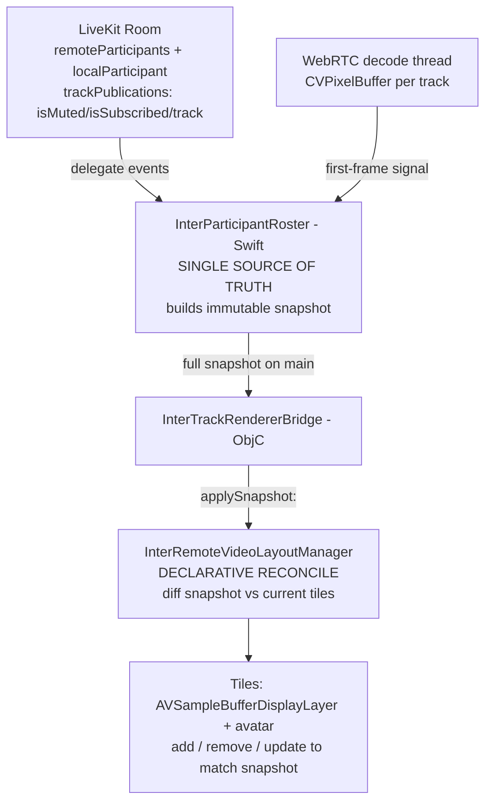

# Presence-Driven Tile Management — Design Spec

- **Date:** 2026-06-05
- **Scope:** Normal call mode only (secure interview mode migrates in a follow-up)
- **Status:** Draft for review

---

## 1. Problem Statement

Tile management in normal call mode is inconsistent and racy. Observed bugs during testing:

1. **Participant side shows no remote tiles.** A participant joining a room where the host
   is already present never gets the host's tile (until the host toggles their camera).
2. **Avatar floats above a live camera feed.** When frames arrive, the avatar placeholder is
   not reliably hidden, so it overlaps the live video.
3. **Camera on but no feed on host.** A participant's camera is on, but the host shows no feed.
4. **Inconsistent across roles and participant counts.** Behaviour differs between host and
   participant, and is nondeterministic as participant count changes.

### Root cause (single underlying flaw)

Tile state is **mutated** from four independent, racy sources rather than **derived** from one
source of truth:

- presence join/leave events,
- first-frame dispatch path,
- track-end / mute / unmute events,
- persisted dictionaries (`cameraOffStates`, `remoteCameraViews`, `tileViews`,
  `pendingFirstFrameIdentifiers`).

Whichever event fires first or last "wins", so the UI drifts out of sync with reality.

The participant-side bug (#1) is a concrete instance: `InterLiveKitSubscriber.attach(to:)` seeds
already-present participants via `trackRenderer?.remoteParticipantDidJoin?(...)`, but
`trackRenderer` is wired **later** (in `wireNormalRemoteRendering`). Optional chaining on a `nil`
delegate silently drops those join events. The host joins an empty room, so it never hits this —
which is why the bug looked host-specific.

---

## 2. Goals / Non-Goals

### Goals
- A single authoritative model drives all tiles for **all** roles (host + participant) and **any**
  participant count.
- Local self-view is modeled as just another participant (avatar when own camera off, feed when on).
- Replace the custom Metal remote-camera renderer with `AVSampleBufferDisplayLayer`.
- Eliminate the four failing scenarios above by construction, not by patching individual events.

### Non-Goals
- Secure interview mode (`SecureWindowController`) — unchanged this pass; migrate later.
- Screen-share rendering — `MetalSurfaceView` / `MetalRenderEngine` stay exactly as-is.
- Avatar imagery beyond initials (no profile pictures this pass).
- Recording pipeline changes (the recording frame delegate path is preserved untouched).

---

## 3. Architecture Overview



Three layers:

1. **Roster (Swift, new):** observes the Room, owns truth, emits immutable snapshots.
2. **Reconciler (ObjC, in layout manager):** one method `applySnapshot:` diffs snapshot vs current
   tiles and makes them match. The **only** code path that changes tile lifecycle/state.
3. **Renderer (per-tile view):** `AVSampleBufferDisplayLayer`-backed view for remote cameras;
   `AVCaptureVideoPreviewLayer` for local self (unchanged under the hood, driven by the snapshot).

---

## 4. Component Design

### 4.1 `InterParticipantRoster` (new Swift class)

**Responsibility:** Single source of truth for "who is in the room and what is their media state."

**Inputs:**
- LiveKit `Room` delegate events: `participantDidConnect`, `participantDidDisconnect`,
  `didSubscribeTrack`, `didUnsubscribeTrack`, `didUpdateIsMuted`, active-speaker changes.
- First-frame signals from the existing per-track `RemoteFrameRenderer` (so a remote tile only
  reports `cameraOn` once a real frame has decoded — avoids showing a black feed).
- `room.localParticipant` for the local self entry.

**Output:** an immutable snapshot pushed to the bridge on the **main thread** whenever anything
changes:

```
struct ParticipantSnapshotEntry {
    let identity: String
    let displayName: String
    let isLocal: Bool
    let cameraOn: Bool        // remote: subscribed && track present && !muted && firstFrameSeen
                              // local:  local capture active
    let micMuted: Bool
    let handRaised: Bool
    let isSpeaking: Bool
    let isScreenSharing: Bool
}

// snapshot = ordered [ParticipantSnapshotEntry]  (stable ordering: local first, then join order)
```

**Key behaviours:**
- On **any** change, rebuild the **entire** snapshot (no incremental UI mutation upstream).
- Emission is **coalesced** on the main thread (latest-wins) to avoid churn when many events
  arrive in a burst (e.g. 10 participants join at once).
- **Idempotent re-sync:** whenever the downstream delegate (bridge) is (re)wired, the roster
  immediately emits its current full snapshot. This is what kills the attach()-before-trackRenderer
  race — correctness no longer depends on event ordering.
- **Isolation invariant [G8] preserved:** the roster only reads Room/track state; it never mutates
  local capture or recording.

**Threading:** delegate callbacks arrive on LiveKit's queue and first-frame signals on the decode
thread; both funnel through a single serial step that coalesces and dispatches the snapshot to main.

### 4.2 `applySnapshot:` reconciler (in `InterRemoteVideoLayoutManager`)

**Responsibility:** Make on-screen tiles match the snapshot. The single entry point for tile
lifecycle and per-tile state.

**Algorithm (declarative diff):**
1. Compute `incoming = {entry.identity}` from snapshot, `current = tileViews.keys`.
2. **Removals:** `current − incoming` → tear down tile + per-track renderer.
3. **Additions:** `incoming − current` → create tile (avatar shown by default; feed view ready).
4. **Updates:** for every entry, set tile state **from the snapshot every pass**:
   - `cameraOn` → show feed view, hide avatar; else show avatar, hide feed.
   - `micMuted` → mic badge; `handRaised` → hand badge; `isSpeaking` → speaking ring;
     `displayName` → label + avatar initial.
5. Trigger `applyCurrentLayout` for positioning.

**Critical rule:** `applyCurrentLayout` (grid/stage/filmstrip geometry) only **positions** tiles. It
**never** sets `cameraOff`/avatar/visibility. All such state is derived from the snapshot. Because
avatar visibility is recomputed every reconcile pass, it can never float over a live feed (fixes #2).

**Active speaker (two-tier, preserved):** The snapshot carries `isSpeaking` per entry. The reconcile
pass derives appearance from it; positioning follows the existing two-tier rule (matches
Zoom/Meet/Teams):

- **Green border highlight** (`isSpeaking` → `borderColor = systemGreen`): applied in **all** modes
  (grid + stage). Cost is a single per-tile `borderColor` assignment — **no relayout**, so it is
  feasible and cheap everywhere.
- **Spotlight promotion** (promote speaker to the main stage, with the existing 3s revert timer and
  user-pin override): **stage / screen-share-with-cameras modes only**. Deliberately **not** in
  grid — reordering a grid on every speaker change forces a full geometry relayout + animation
  thrash and makes tiles jump around (bad UX and performance, worse at high participant counts).

**Tile ordering:** stable — **local self first, then remote join order**. Active-speaker changes
affect *appearance* (border) in every mode but *position* only in stage mode. Grid order never
reorders on speaker change.

**Deletions:** `cameraOffStates`, `pendingFirstFrameIdentifiers` + its lock, and the scattered
mutations in the presence-join / first-frame / track-end / mute paths are removed. Those events now
flow into the roster, not directly into the UI.

### 4.3 Renderer: `AVSampleBufferDisplayLayer`

**Responsibility:** Render remote camera frames per tile.

**Approach:** New `AVSampleBufferDisplayLayer`-backed view (refit `InterRemoteVideoView` or add a
sibling `InterRemoteSampleBufferView`).

**Frame path:** incoming `CVPixelBuffer` → wrap as `CMSampleBuffer`
(`CMSampleBufferCreateReadyWithImageBuffer` with a `CMVideoFormatDescription` from the buffer) →
`AVSampleBufferDisplayLayer.enqueue(_:)`. Apple handles YCbCr→RGB conversion and display scheduling.

**Mirror:** apply a horizontal flip via the layer's `transform` (`CATransform3DScale(t, -1, 1, 1)`)
instead of a Metal shader. Local preview keeps `videoMirrored = YES` so local and remote mirror
consistently.

**Deletions (and the bug classes they remove):**
- `CVDisplayLink` (per-view thread + the drawableSize/blank-screen timing bugs),
- `CVMetalTextureCache`, BT.709 Metal shader, manual `drawableSize`,
- `shutdownRenderingSynchronously`, render semaphore.

**Untouched:** `MetalSurfaceView` and `MetalRenderEngine` remain for screen share only.

### 4.4 Local self-view

Local self is a snapshot entry (`isLocal = true`). Under the hood it still uses
`AVCaptureVideoPreviewLayer` (no network round-trip), but its tile is created/updated/removed by the
same reconcile path. Camera off → avatar with own initial; camera on → preview layer.

---

## 5. Data Flow — the four failing scenarios

| Scenario | Snapshot result | Reconcile result |
|---|---|---|
| Participant joins room where host already present | roster already contains host (idempotent re-sync on wire-up) | host tile created (avatar if cam off, feed when frame lands) ✅ #1 |
| Remote camera turns on | `didUpdateIsMuted(false)` + first frame → `cameraOn=true` | hide avatar, show feed ✅ #2/#3 |
| Camera off / track ends / participant leaves | snapshot updates / entry removed | show avatar or remove tile ✅ |
| N participants, host or participant role | identical snapshot → identical reconcile for everyone | consistent at any count/role ✅ #4 |

---

## 6. Edge Cases & Error Handling

- **First-frame gating (remote):** `cameraOn` stays `false` (avatar shown) until the first decoded
  frame; flips to feed the instant a frame lands — never a black feed.
- **Burst coalescing:** many simultaneous joins/leaves collapse to the latest snapshot on main.
- **Re-wire / reconnect:** roster re-emits full snapshot, so late delegate wiring or reconnect
  self-heals.
- **Screen share active:** orthogonal — handled by the existing `MetalSurfaceView` path; the roster
  exposes `isScreenSharing` only for badge/state, not rendering.
- **Isolation [G8]:** roster is read-only w.r.t. local capture and recording.

---

## 7. Testing Strategy

- **Unit — roster snapshot computation** (pure logic, mocked Room states):
  - join-before-wire (host present at attach), camera toggle, track end, participant leave,
    local-only, N participants, burst coalescing.
- **Unit — reconciler diff** (snapshot in → add/remove/update assertions on tiles).
- **Integration** (`interTests/InterMultiParticipantTests.swift`):
  - host+participant symmetry, rejoin-after-empty-room, avatar↔feed transitions.

---

## 8. Incremental Sequencing (each step builds green)

1. **Roster, log-only.** Add `InterParticipantRoster` + snapshot type; wire it to observe the Room
   and emit snapshots to a logging sink. No UI behaviour change yet.
2. **Reconciler.** Add `applySnapshot:`; route the roster into the bridge → layout manager; switch
   tile lifecycle to the reconciler; delete `cameraOffStates`, `pendingFirstFrameIdentifiers`, and
   the scattered mutation paths.
3. **Renderer swap.** Replace the Metal remote-camera view with `AVSampleBufferDisplayLayer`.
4. **Cleanup + tests.** Remove dead Metal camera code; add unit + integration tests.

---

## 9. Risks & Mitigations

- **`CMSampleBuffer` wrapping correctness** (format description / timing): validate against NV12 and
  BGRA inputs; add a format-detection log parity check with the old path during step 3.
- **Behavioural regressions in layout geometry:** step 2 keeps `applyCurrentLayout` math intact and
  only changes *who sets state*, limiting blast radius.
- **Screen-share coupling fears:** none — `MetalSurfaceView` path is untouched and independently
  exercised.

---

## 10. Open Questions

- Keep the `InterRemoteVideoView` filename (refit in place) vs introduce a new file? (Leaning:
  refit in place to minimise call-site churn; final call at step 3.)

**Resolved:**
- **Tile ordering:** local self first, then remote join order, **stable** (no reorder on speaker
  change).
- **Active speaker:** green-border highlight in all modes; spotlight promotion in stage mode only.
  Folds into the snapshot via `isSpeaking`; reuses the existing `setActiveSpeakerIdentity:` /
  auto-spotlight machinery (driven by the snapshot rather than ad-hoc events).
